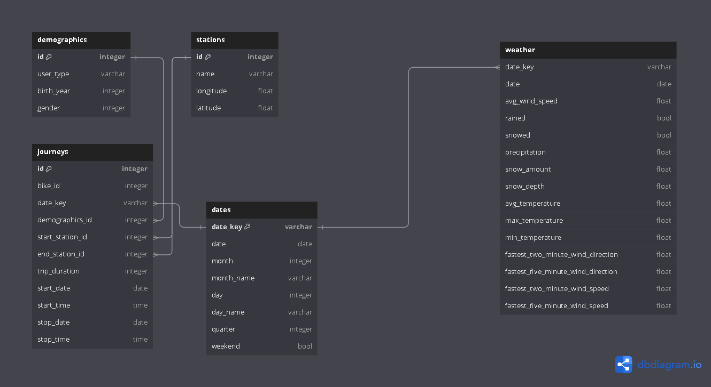

# Citibike Rental Data Management
 
Management of data and database creation, to allow for analysis of the effect of weather on bike rentals.

## Project Overview

Over the 2010s and 2020s, bike rentals have become big business in cities around the world. This project seeks to showcase how data engineers might manage rental data, combined with weather data, to allow for analysis of the effect of weather on bike rentals. As such, the project will attempt to create a database that for this purpose, using Citibike rental data and data from the NOAA.

This project involved:
- Cleaning & Wrangling of data
- Design of database schema
- Creation of database tables
- Creation of data views

## Cleaning & Wrangling

Using python, within a [Jupyter Notebook](bike_rental_data_management.ipynb), I started by cleaning and wrangling both the weather data and the Citibike data using pandas. This included the handling of missing values, investigating unexpected values, managing datatypes and managing variable names. Data was then split into tables that followed the schema. These dataframes were subsequently inserted into the PostgreSQL database using sqlalchemy.

## Database Design

After understanding the data, I designed a database schema displaying the tables and relationships of the data. This gave me an understanding of how data would be stored for analysis, as well as a visual determination of how the direction I would proceed in. Using SQL, I created the tables in [tables.sql](tables.sql), following the schema exactly.

## Views

Finally, I created views of the data to help along any further analysis of the Citibike and weather data in [views.sql](views.sql). I created the following views:

1. daily_counts - a day-by-day count of different journeys.
2. daily_data - an overview of different variables for each given day.
3. monthly_data - an overview of different variables for each given month.
4. weather_journeys - an overview of journeys and weather for different days, with comparisons for the same day a week prior.

## My Portfolio

If you'd like to check out the rest of my portfolio, please feel free to do so [here](https://charlie-marshall.dev)!
